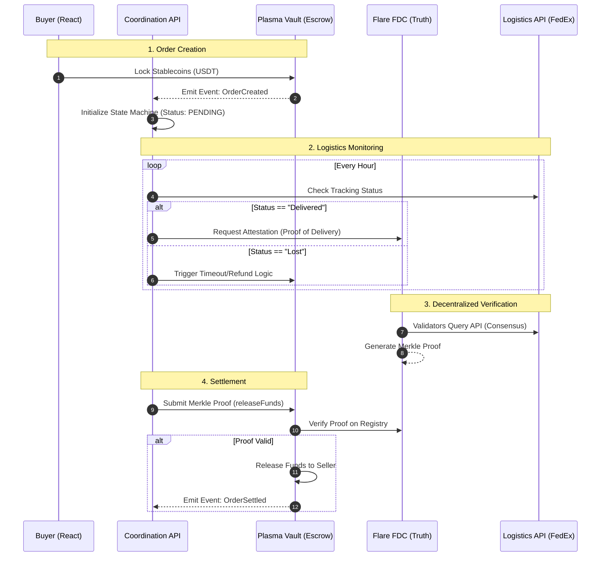

# Magma Architecture: The "Money 2.0" Stack

> **"Liquid Capital. Solid Truth."**

This document outlines the technical architecture of **Magma Marketplace**, designed as a multi-chain primitive for **Verifiable B2B Commerce**.

---

## 1. The Core Thesis: Specialized Layers

We reject the monolithic blockchain model. Magma is built on the thesis that **Settlement** and **Verification** require specialized infrastructure.

### A. The Settlement Layer (Liquid): Plasma
*   **Role:** The "Cash Register."
*   **Why Plasma?**
    *   **Zero-Gas:** Native Paymasters abstract gas fees entirely.
    *   **Instant Finality:** PlasmaBFT provides sub-second settlement.
    *   **Stablecoin Optimization:** The VM is tuned for high-velocity stablecoin transfers, not generic compute.
*   **Key Contract:** `PlasmaPayment.sol` (The Vault).

### B. The Truth Layer (Solid): Flare
*   **Role:** The "Judge."
*   **Why Flare?**
    *   **Enshrined Oracles:** The **Flare Data Connector (FDC)** allows the network to reach consensus on off-chain API states (e.g., FedEx API) without trusting a single node.
    *   **Decentralized Attestation:** Unlike Chainlink (which pushes prices), Flare allows us to *pull* specific event verifications on-demand.
*   **Key Contract:** `ShipmentTracker.sol` & `DeliveryRegistry.sol`.

---

## 2. The Bridge: Production Coordination

In a production environment, relying on a single "Happy Path" transaction is naive. Real-world logistics is messy (lost packages, customs holds, API outages).

### The Coordination API (State Machine)
We introduce a **TypeScript/Node.js Coordinator** that sits between the Web2 Logistics world and the Web3 Settlement layer.

**It is NOT an Oracle.** It is a **Lifecycle Manager**.
*   **Oracle:** Says "This is true." (Only Flare does this).
*   **Coordinator:** Says "This order is 3 days late, trigger a timeout check." (The Coordinator does this).

---

## 3. System Flow (The "Magma Protocol")

The following diagram illustrates the **Production-Grade** flow, including the Coordination Layer.

---

## 4. Security & Risk Mitigation

*   **Zombie Escrows:** Prevented by the Coordination API's timeout logic.
*   **Oracle Failure:** If Flare FDC goes down, the contract has a `Timelock` fallback allowing the Buyer to reclaim funds after 30 days.
*   **Relayer Centralization:**
    *   *Phase 1 (MVP):* Single Relayer Key.
    *   *Phase 2 (Prod):* **Gelato Network** or **OpenKeepers** for decentralized automation.

---

## 5. Technical Stack

| Layer | Component | Technology |
|---|---|---|
| **Interface** | Dashboard | React, Vite, Privy, Tailwind |
| **Infrastructure** | Relayer/API | TypeScript, Ethers.js v6, Supabase |
| **Truth** | Oracle | Flare FDC, Solidity |
| **Settlement** | Escrow | Plasma, OpenZeppelin, Solidity |
