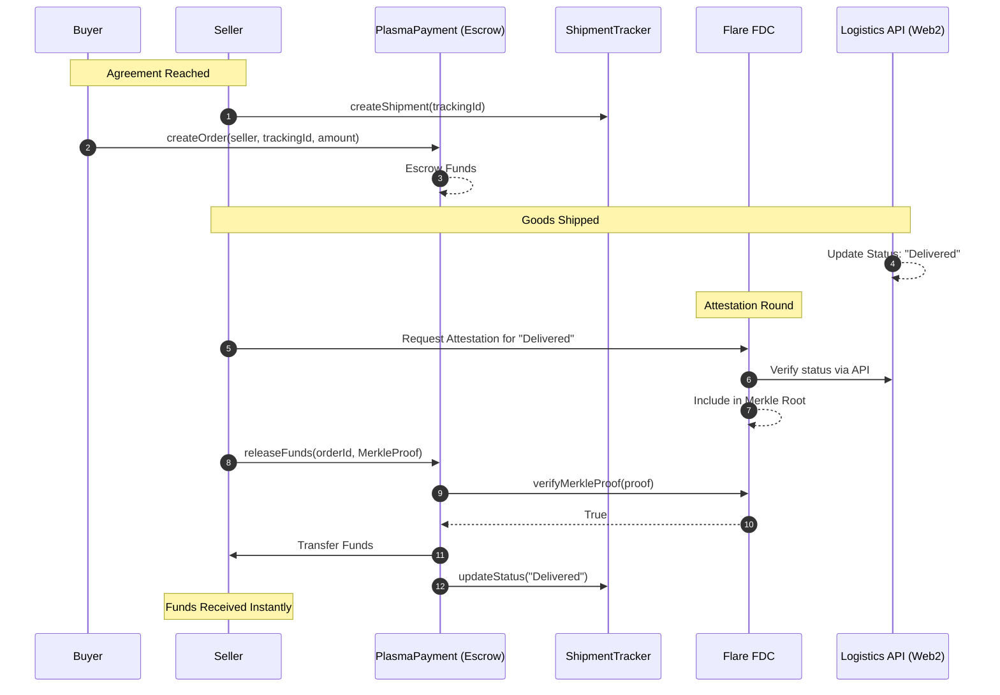

# Architecture: Verifiable B2B Commerce

## 1. The Primitive: Verifiable B2B Commerce

This project establishes a new digital primitive: **Verifiable B2B Commerce**.

Traditional supply chain finance relies on slow, expensive, and opaque intermediaries (banks, letters of credit) to build trust between buyers and sellers. We replace these centralized intermediaries with **cryptographic proof**.

By binding real-world logistics data to on-chain settlement, we create a system where funds are released *instantaneously* and *trustlessly* upon delivery verification. This eliminates counterparty risk without the fee extraction of traditional trade finance.

## 2. The Plasma Layer: High-Speed Settlement Rails

**Plasma** serves as the Layer 1 settlement rail for this architecture.

*   **Low-Cost, High-Speed**: Plasma is designed for high-throughput stablecoin transactions, making it the ideal "cash register" for global trade. It solves the "last-mile" payment problem where high gas fees or slow finality on other chains consume the thin margins of physical goods trade.
*   **Escrow Logic**: The `PlasmaPayment.sol` contract acts as a programmable escrow. It holds the buyer's stablecoins and only releases them when cryptographic proof of delivery is presented.

## 3. The Flare Layer: The Data Bridge

**Flare** provides the decentralized oracle infrastructure that makes the physical world "readable" by the blockchain.

*   **Flare Data Connector (FDC)**: This is the core verification engine.
    *   **Bridge to Web2**: Logistics providers (DHL, FedEx, Maersk) publish tracking data to standard Web2 APIs.
    *   **Trustless Verification**: The FDC allows an attestation provider to submit a Merkle proof confirming that a specific shipment ID has the status "Delivered". `IFlareDataConnector` validates this proof on-chain against a state root, triggering the `PlasmaPayment` release.
*   **Flare Time Series Oracle (FTSO)**: (Future Integration) Ensures accurate FX rates if payments involve currency conversion, protecting SMEs from volatility during the shipping period.

## 4. Mission Alignment: New Consumer Primitives

This architecture is built for the **New Consumer Primitives** track, specifically aligned with **SikaHub's mission for financial inclusion**.

*   **Empowering SMEs**: Small and Medium Enterprises in emerging markets are often excluded from global trade because they lack the credit history for letters of credit.
*   **Removing Predatory Fees**: By using crypto-native settlement rails, we bypass the 3-10% FX and processing fees charged by cross-border payment processors.
*   **Trustless Access**: Enabling "trustless" relationships allows an artisan in Kenya to sell directly to a boutique in London with the same security as a Fortune 500 company.

## 5. System Flow

